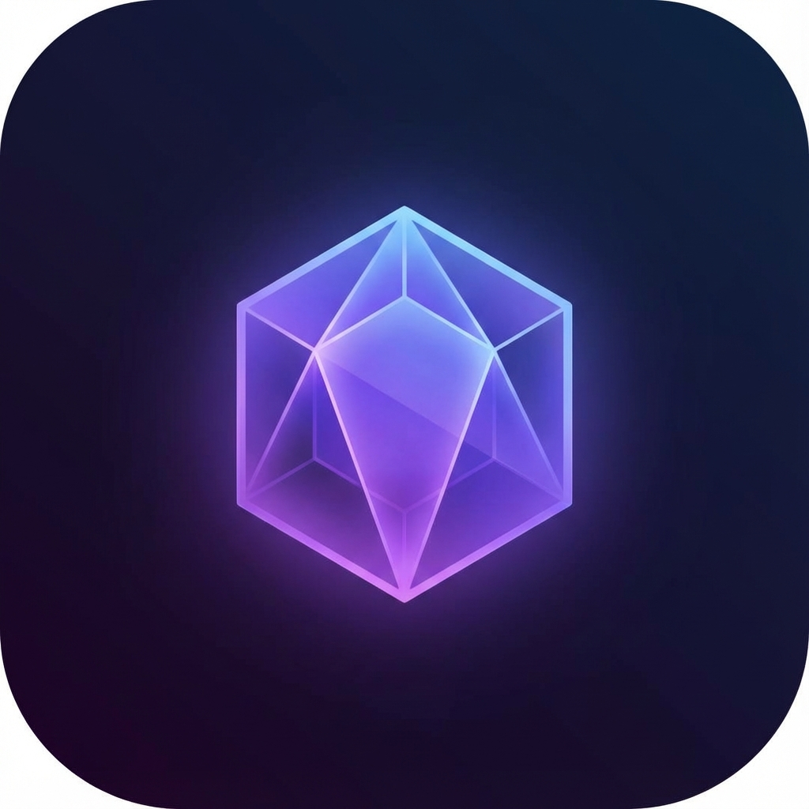

# 🎵 ASH Player - Progressive Web App

A modern, beautiful music player inspired by Spotify, now available as a Progressive Web App (PWA) with full mobile support!



## ✨ Features

### 🎯 Core Features
- 🎵 Multiple playlist categories (Chill Vibes, Workout Mix, Study Session, Party Anthems)
- 🔄 Recently Played & Liked Songs
- 🎚️ Full playback controls (play, pause, next, previous, shuffle, repeat)
- 🔊 Volume control with mute
- ⏱️ Progress bar with seek functionality
- 💜 Like/unlike songs
- 👤 User profile dropdown

### 📱 PWA Features
- ✅ **Installable** - Add to home screen like a native app
- ✅ **Offline Support** - Works without internet connection
- ✅ **Mobile-Optimized** - Fully responsive design
- ✅ **App-Like Experience** - Fullscreen mode with custom theme
- ✅ **Touch-Friendly** - Large touch targets and gesture support

### 🎨 Design
- Premium dark theme with gradient accents
- Smooth animations and transitions
- Glassmorphism effects
- Mobile-first responsive design
- Beautiful album artwork display

## 🚀 Quick Start

### Local Development

1. **Clone or download** the repository

2. **Start a local server:**
   ```bash
   npx serve -l 3000
   ```

3. **Open in browser:**
   - Navigate to `http://localhost:3000`
   - For mobile testing: `http://[YOUR-IP]:3000`

### Installation

#### Android (Chrome/Edge)
1. Open the app in Chrome or Edge
2. Tap "Install" prompt or menu → "Install app"
3. App appears on home screen

#### iOS (Safari)
1. Open the app in Safari
2. Tap Share → "Add to Home Screen"
3. App appears on home screen

#### Desktop (Chrome/Edge)
1. Look for install icon in address bar
2. Or click the install button in the app
3. App opens in standalone window

## 📁 Project Structure

```
ash-player/
├── index.html          # Main HTML file with PWA meta tags
├── styles.css          # Responsive CSS with mobile-first design
├── app.js              # JavaScript with PWA features
├── manifest.json       # Web App Manifest
├── sw.js               # Service Worker for offline support
├── offline.html        # Offline fallback page
├── icons/              # App icons (192x192, 512x512)
│   ├── icon-192.png
│   ├── icon-512.png
│   └── apple-touch-icon.png
└── assets/             # Album artwork
    ├── album1.png
    ├── album2.png
    ├── album3.png
    ├── album4.png
    └── album5.png
```

## 🔧 Technical Details

### Technologies Used
- **HTML5** - Semantic markup
- **CSS3** - Custom properties, gradients, animations
- **JavaScript (ES6+)** - Modern features, service workers
- **PWA APIs** - Service Worker, Web App Manifest, Install Prompt

### Browser Compatibility
- ✅ Chrome/Edge (Desktop & Mobile) - Full support
- ✅ Firefox - Full support
- ✅ Safari (iOS) - Limited PWA support

### Service Worker
- Cache-first strategy for static assets
- Network-first for HTML pages
- Automatic cache management
- Offline fallback page

### Mobile Optimizations
- Hamburger menu for navigation
- Touch event handlers
- Prevented pull-to-refresh conflicts
- Larger touch targets (44x44px minimum)
- Landscape orientation support

## 🎯 Deployment

### GitHub Pages
1. Push code to GitHub
2. Go to Settings → Pages
3. Select branch and save
4. Visit `https://[username].github.io/[repo-name]`

### Other Hosting
Any static hosting service works:
- Netlify
- Vercel
- Firebase Hosting
- Cloudflare Pages

> **Note:** Ensure HTTPS is enabled (required for service workers)

## 📱 Mobile Responsive Breakpoints

- **Mobile**: 0-768px (collapsed sidebar, hamburger menu)
- **Tablet**: 769-1024px (optimized spacing)
- **Desktop**: 1025px+ (full layout with sidebar)

## 🎨 Color Palette

```css
Primary Background: #0a0a0f
Secondary Background: #121218
Accent Color: #667eea
Gradient: linear-gradient(135deg, #667eea 0%, #764ba2 100%)
Text Primary: #ffffff
Text Secondary: #b3b3b3
```

## 🔑 Keyboard Shortcuts

- `Space` - Play/Pause
- `→` - Next track
- `←` - Previous track
- `↑` - Volume up
- `↓` - Volume down

## 📄 License

This project is open source and available for personal and educational use.

## 🙏 Acknowledgments

- Design inspired by Spotify
- Icons from custom SVG library
- Fonts: Inter (Google Fonts)

---

**Built with ❤️ by ASH**

*Enjoy your music, anywhere, anytime! 🎵*
